## Neoscope – Smart Camera & AI Assistant 📸🤖

Neoscope is an advanced Android application that combines computer vision, AI-powered assistants, and smart camera functionalities in a single, seamless experience. Built with Kotlin and Jetpack Compose, it integrates multiple AI services for real-time detection, recognition, and interactive tasks.

## 🎯 Features
# Smart Camera & Vision

Capture photos directly in-app with a smart camera interface.

Object Detection using TensorFlow models.

Text Recognition & Translation with Google ML Kit.

QR Code Scanning for quick data retrieval.

# AI Assistance

Conversational AI chatbot powered by LLaMA.cpp.

Custom Hugging Face models for:

Classification

Image generation

Image editing

Background removal

Unified AI services via a Flask backend (tunneled via ngrok) for smooth client-server communication.

# Authentication

Firebase Authentication

Google Sign-In

##🎥 Demo

## 📸 ScreenShots

### Authentication
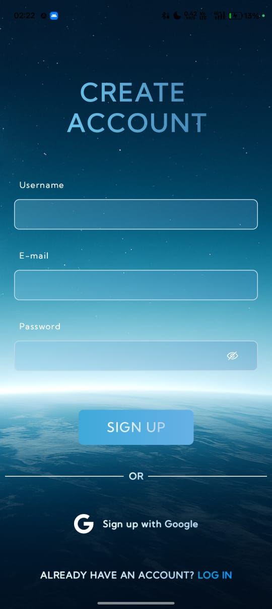

### Main Interface
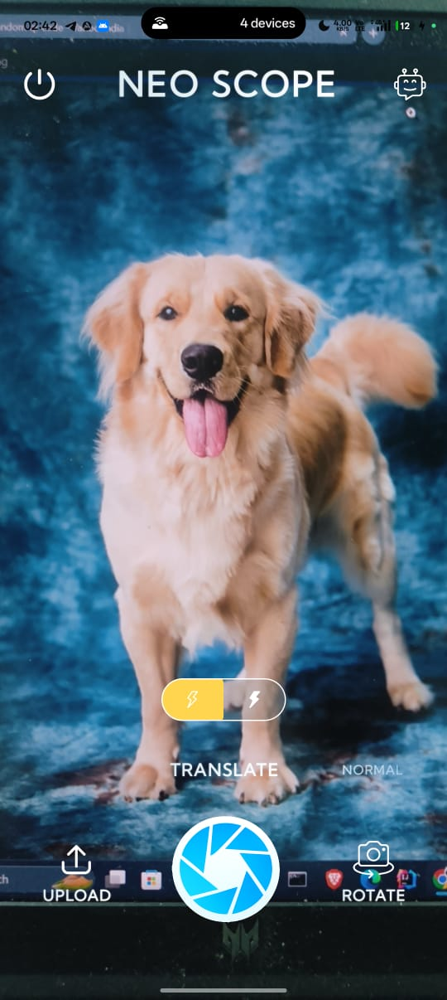
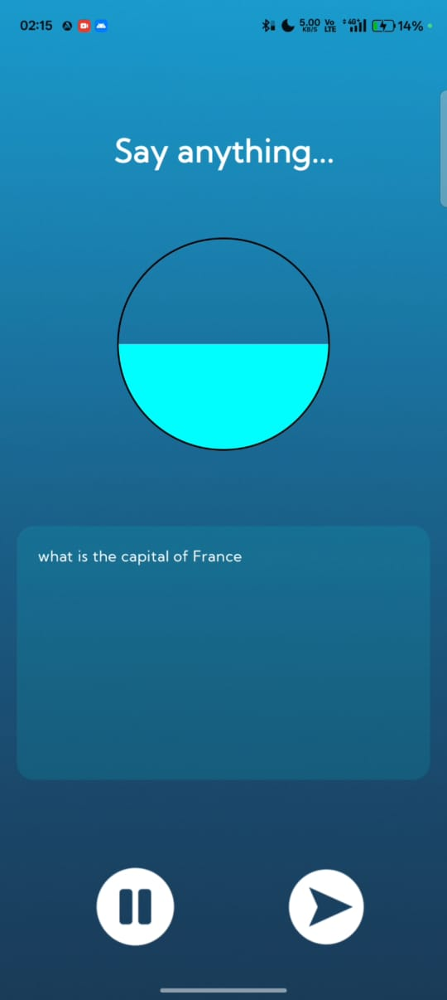

### Chatbot
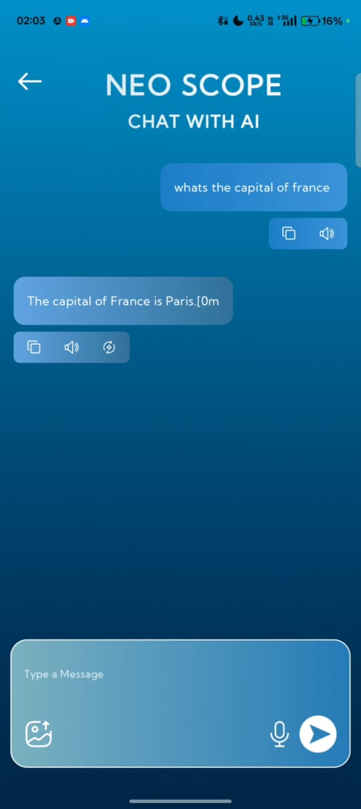

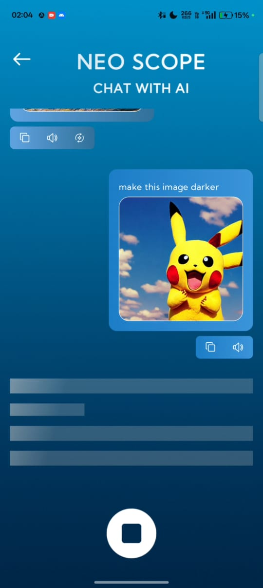
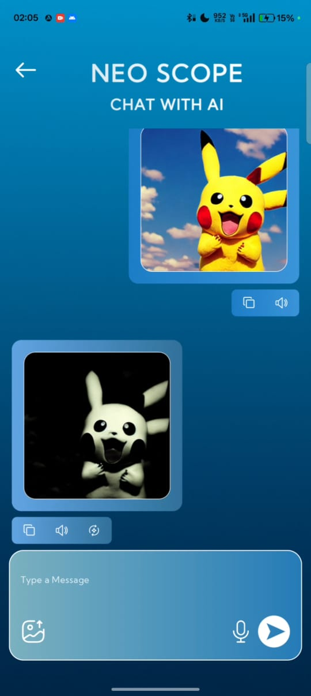
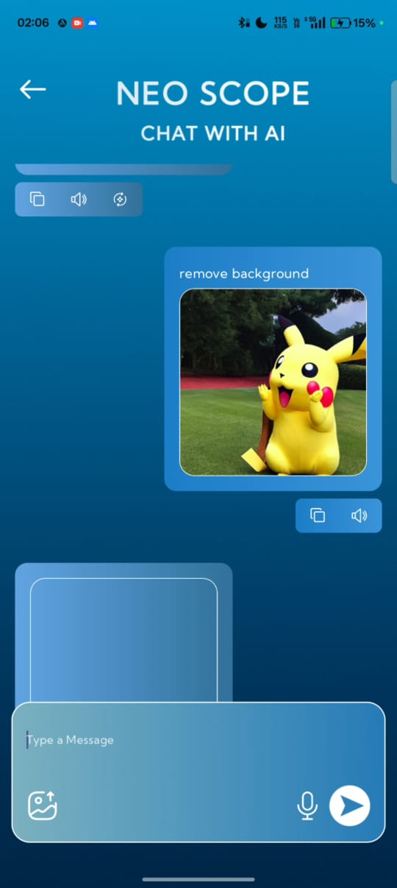
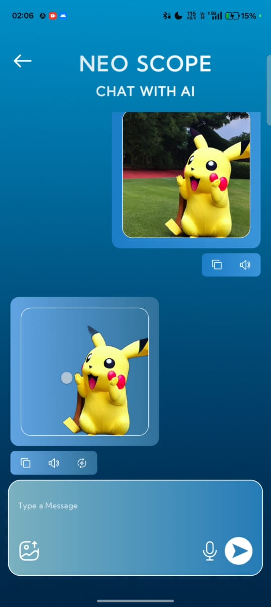

### Object Detection & QR
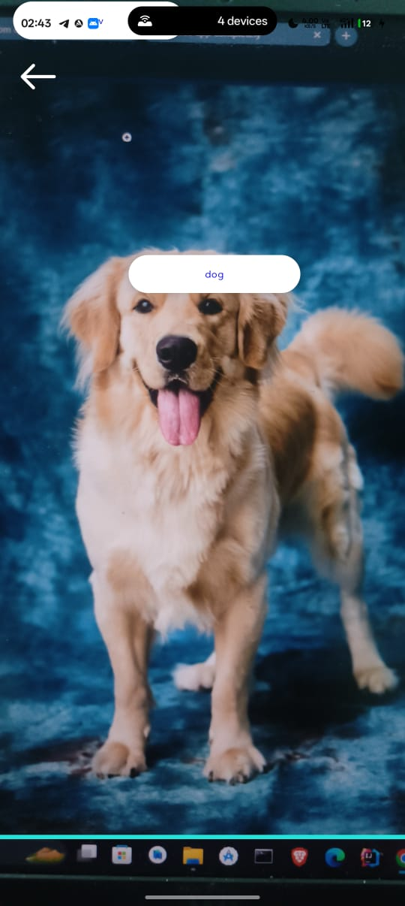
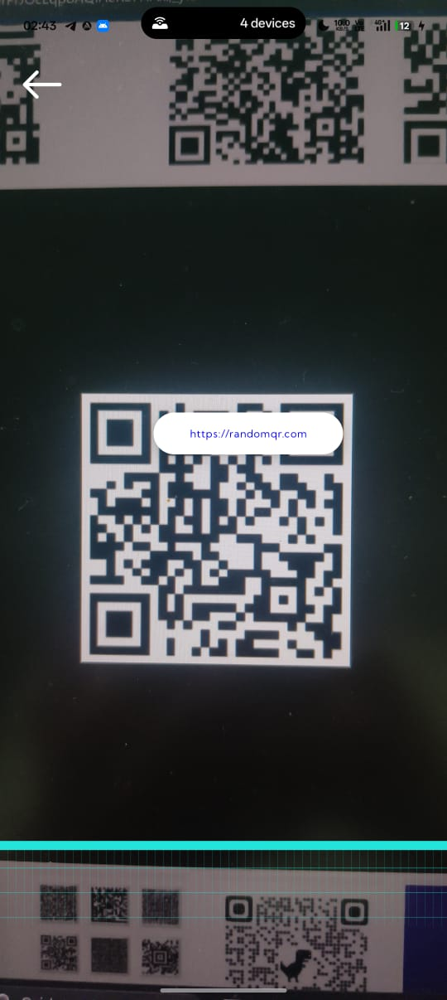

### Text Recognition & Translation
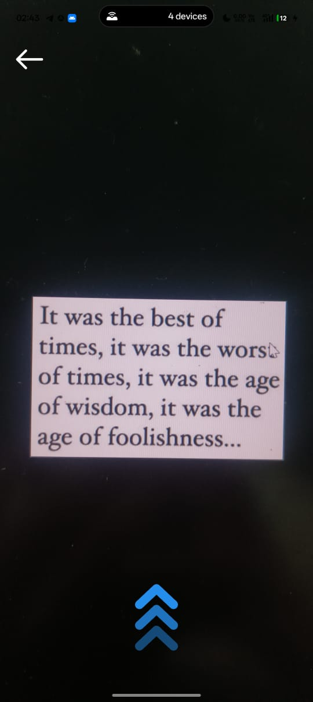
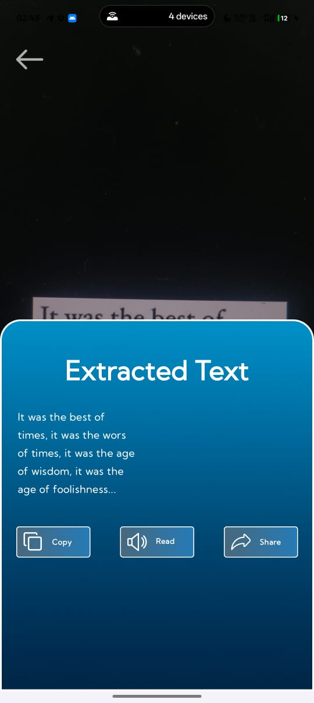
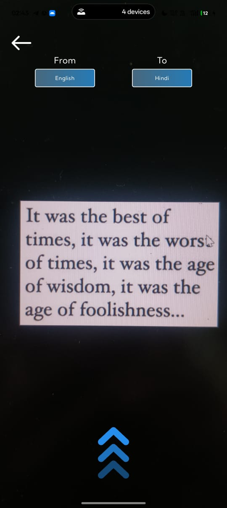
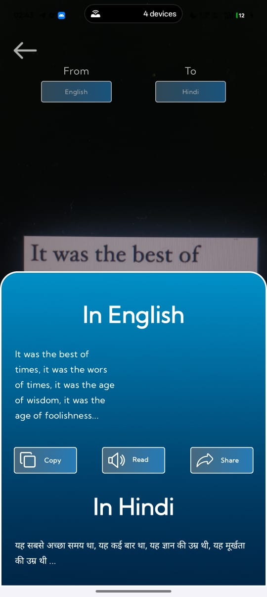

## Video Demo

[Watch Full Demo Video](https://github.com/Vishwash123/NeoScope-SmartCameraApp/releases/download/v1.0/neoscope-demo.mp4)

## ⚙️ Tech Stack

Frontend: Kotlin, Jetpack Compose, Android SDK

Backend: Flask (Python)

AI Models: LLaMA.cpp, Hugging Face models, TensorFlow

Services: Firebase, Google ML Kit, ngrok

## 🖥️ Backend

The AI services are powered by a separate **Flask backend** which handles:

- AI model inference (LLaMA.cpp, Hugging Face models)
- Photo and text processing
- Serving AI features to the Android client

You can find the backend repository here: [Neoscope Backend](https://github.com/Vishwash123/neoscope-backend)

